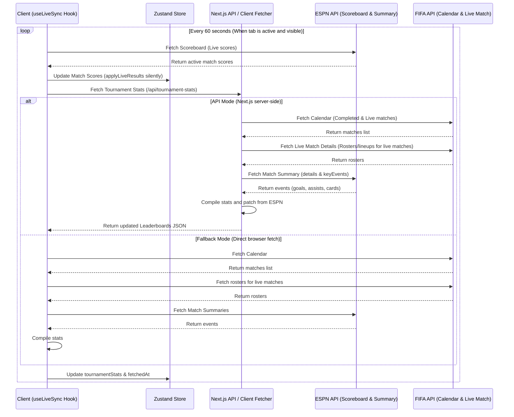

# Design Specification: Real-time Stats & Live Match Background Updates

This design document specifies the architectural changes required to automatically synchronize real-time match results and tournament player statistics (goals, assists, cards, etc.) in the background of the WC 2026 Simulator, including support for live (in-progress) matches.

## 1. Objectives & Success Criteria

- **Background Sync:** The application automatically updates match results in the background every 60 seconds without blocking/confirming popups.
- **Live Match Support:** Player statistics (top scorers, assists, cards) are computed and updated in real-time while live matches are currently in progress.
- **Data Consistency:** Both simulation standings and player statistics are derived from a unified, synced state.
- **Offline Resilience:** The application remains compatible with static site hosting (GitHub Pages client-side fallback) and defaults to offline static data if APIs are unreachable.

---

## 2. Architecture & Data Flow

The flow diagram below outlines the synchronization process:

---

## 3. Detailed Component & Code Changes

### 3.1. Zustand Store (`src/lib/store.ts`)
We will centralize tournament player stats in the Zustand store:

- **State Additions:**
  - `tournamentStats`: The aggregated leaderboards object (goals, assists, penalties, own goals, yellowCards, redCards).
  - `statsFetchedAt`: String timestamp of the last successful stats fetch.
- **Action Additions:**
  - `setTournamentStats(stats: TournamentStatsSnapshot)`: Overwrites the cached stats.
- **Action Updates:**
  - `applyLiveResults(updates, silent)`: Modify to support silent updates without causing UI modal confirmation prompts when triggered from the background.

### 3.2. Tournament Stats Aggregation (`src/lib/tournament-stats-core.ts`)
- **Extend `isCompletedMatch`:** Create `isLiveOrCompletedMatch(match)` to select matches that are completed OR currently in-progress (e.g. `ResultType === 0 && OfficialityStatus === 2` or according to ESPN Live status).
- **Lineups and Rosters:** Create `initializeEmptyPlayerStats(liveMatch)` which prepares baseline entries for all players in `liveMatch?.HomeTeam?.Players` and `AwayTeam?.Players` with 0 stats.
- **Enhance `patchMatchPlayerStats`:**
  - Extend the event parser to capture all required event types from ESPN's `details` and `keyEvents`:
    - **Goal (`goal`):** Increases `goals`.
    - **Own Goal (`own-goal`):** Increases `ownGoals`.
    - **Yellow Card (`yellow-card`):** Increases `yellowCards`.
    - **Red Card (`red-card` or equivalent red card text):** Increases `redCards`.
    - **Assist:** Parse text/details to associate assists with the assisting player and increase `assists`.
    - **Penalty:** Parse events to detect penalties shot (`penalties`) and penalty goals scored (`penaltiesScored`).

### 3.3. Stats Fetching Logic (`src/app/api/tournament-stats/route.ts` & `src/lib/tournament-stats-fetch.ts`)
- Fetch live matches alongside completed matches from the FIFA Calendar.
- For live matches, call `fetchCompletedMatch` (which returns the match details containing player rosters) even if the playerStats file on `fdh-api.fifa.com` does not exist yet. Catch 404 errors for the players stats file, returning an empty playerStats object to be populated entirely by ESPN live events.
- Perform the ESPN patching process on all live and completed matches.

### 3.4. Background Synchronizer Hook (`src/lib/hooks.ts` / `src/components/useLiveSync.ts`)
Create a custom React hook `useLiveSync` which is initialized in the `AppShell.tsx`:
- Runs an effect with a timer of 60 seconds.
- Uses `document.visibilityState === 'visible'` to only poll when the user is actively viewing the page.
- Fetches ESPN Scoreboard and silently applies updates to the store.
- Fetches `/api/tournament-stats` and calls `setTournamentStats` in the store.
- Manages an `isSyncing` state and displays a subtle header notification toast/banner (e.g. "Đang tự động cập nhật...") that disappears after a successful sync, instead of triggering blocking `confirm()` dialogs.

### 3.5. Component Updates (`src/components/TournamentStatsBoard.tsx` & `src/components/SyncLiveResultsButton.tsx`)
- **`TournamentStatsBoard.tsx`:**
  - Subscribes to the Zustand store's `tournamentStats` and `statsFetchedAt`.
  - Removes local `setInterval` polling, delegating background polling entirely to the global `useLiveSync` hook.
  - Adds a small "Cập nhật ngay" manual reload button.
- **`SyncLiveResultsButton.tsx`:**
  - Adds a manual sync button that triggers the same silent update manually, but displays a loading spinner.

---

## 4. Error Handling & Edge Cases

- **Rate-Limiting & API Failures:** If any API endpoint returns an error, log it as a warning and fall back to the last cached store state or default offline stats.
- **Player Name Matching:** The `matchesPlayerName` normalization helper is already robust, but if an ESPN player name cannot be resolved in the FIFA squad list, we will log a warning and fallback gracefully without crashing.
- **Tab Inactivity:** Polling halts entirely when the tab is hidden or backgrounded, saving user bandwidth and CPU.

---

## 5. Testing Plan

- **Unit Tests:**
  - Update `src/lib/__tests__/tournament-stats.test.ts` to verify that `patchMatchPlayerStats` correctly aggregates assists, cards, and penalties from simulated ESPN events.
- **Integration Tests:**
  - Verify that Zustand store correctly updates the statistics state and triggers re-renders on components.
- **Manual Verification:**
  - Set a short interval (e.g. 5 seconds) during local development to watch the console logs, verify silent background updates, and observe the UI toast notifications.
